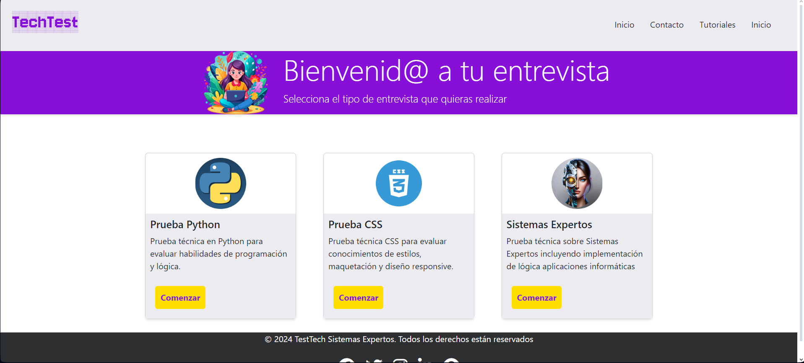

# Desarrollo del Proyecto "TechTest: Sistema Experto para Entrevistas Técnicas."

</img>

## Contenido

- **[1. Descripción](#1-descripción)**
- **[2. Objetivo](#2-objetivo)**
- **[3. Funcionamiento de la aplicación](#3-funcionamiento-de-la-aplicación)**
- **[4. Tecnologías utilizadas](#4-tecnologías-utilizadas)**
- **[5. Estructura del proyecto](#5-estructura-del-proyecto)**
- **[6. Flujo de Trabajo](#6-flujo-de-trabajo)**
- **[7. Mejoras](#8mejoras)**
- **[8. Licencia](#9-licencia)**
- **[9. Autores](#10-autores)**

## 1. Descripción.

El proyecto **TechTest** es una aplicación web que tiene como propósito realizar una entrevista técnica a un usuario a través de diferentes preguntas de un formulario. Tras la evaluación de las respuestas, la persona encargada de selección de personal podrá consultarlo tras saber si ha pasado la prueba o no. 
La aplicación proporciona pruebas de diferentes categorías dentro del mundo del desarrollo web. En esta versión se mostrarán 6 preguntas por categoría las cuales serán seleccionadas de manera aleatoria de la base de conocimiento. Se espera que en futuras versiones se puedan añadir más preguntas. 

[subir](#contenido)

## 2. Objetivo.

El objetivo principal del proyecto es facilitar y automatizar el proceso de entrevistas técnicas para roles relacionados con el desarrollo. Se ha pretendido cumplir con los elementos que caracterizan a los sistemas expertos como tal los cuales son:
- Interfaz de usuario y de comunicación externa a través de una aplicación en Flask.
- Base de datos de conocimiento. Las preguntas de las entrevistas, las respuestas esperadas, las categorías de las pruebas. 
- Motor de inferencia. Reglas que evalúan las respuestas y generan el resultado automatizado sobre el desempeño del candidato.
- Sistema para la explicación de las decisiones tomadas. Mostrando qué respuestas fueron correctas o incorrectas se determina cómo se llega a la conclusión de si un candidato debe seguir en el proceso de entrevista o no.
- Sistema para la adquisición de nuevo conocimiento. El sistema cuenta con la capacidad de agregar nuevas preguntas, actualizar respuestas esperadas o incluso introducir nuevas categorías de pruebas según las tendencias y cambios en el campo del desarrollo web. 

[subir](#contenido)

## 3. Funcionamiento de la aplicación.

Al ingresar a la página principal, el usuario podrá ver las diferentes categorías de preguntas disponibles.

Al hacer clic en una categoría, se desplegarán las preguntas correspondientes a esa categoría. El usuario deberá de rellenar el formulario con sus respuestas.

Al finalizar podrá ver el resultado de su prueba, en la que se le indicará cuantas respuestas correctas ha tenido y cuantas incorrectas.

[subir](#contenido)

## 4. Tecnologías utilizadas.

- [Flask](https://flask.palletsprojects.com/en/3.0.x/)
Framework para Python. Se utiliza en este proyecto para crear la aplicación web y manejar las rutas y las solicitudes HTTP.

- [SpaCy](https://spacy.io)
Biblioteca de procesamiento de lenguaje natural (NLP) de código abierto. Se utiliza para el procesamiento de texto, incluyendo tokenización, análisis gramatical y extracción de información. En este caso se usa para comparar las respuestas del usuario con las respuestas correctas y determinar el grado de acierto.

- [SQLite](https://www.sqlite.org/index.html)
Se utiliza para almacenar las preguntas y respuestas de la aplicación. SQLite es una base de datos relacional que se utiliza en aplicaciones de pequeño y mediano tamaño.

- [Bootstrap y SCSS](https://getbootstrap.com)
Diseño de la interfaz de usuario.

[subir](#contenido)

## 5. Estructura del proyecto.

El proyecto está estructurado de la siguiente manera:

- **main.py**: Archivo principal de la aplicación, contiene las rutas y las funciones que se ejecutan al realizar una solicitud HTTP.
  
- **technical_interview_questions.db**: Base de datos SQLite que contiene las preguntas y respuestas de la aplicación.
  
- **utils.py**: "El archivo utils.py contiene una colección de funciones de utilidad diseñadas para simplificar y mejorar el estilo del archivo principal main.py, proporcionando una forma más elegante y eficiente de realizar tareas específicas dentro del proyecto.
  
- **db/**: Carpeta que contiene los archivos relacionados con la base de datos SQLite. Tiene 2 archivos dentro de ella:
  
  - **database.py**: Script que tiene la creción de las base de datos, creación de las tablas e insercción de los datos. Con este ejecutable se crea el **technical_interview_questions.db**.
  - **query.py**: Consultas para obtener los datos de las tablas.
  
- **templates/**: Carpeta que contiene los archivos HTML de la aplicación.
  
- **static/**: Carpeta que contiene los archivos estáticos de la aplicación, como estilo e imágenes.

[subir](#contenido)

## 6. Flujo de Trabajo. 

__Paso 1__: Identificación de temas clave para la prueba.

__Paso 2__: Recopilación de preguntas y respuestas relacionadas con los temas.

__Paso 3__: Estructurar la Base de Conocimientos.

__Paso 4__: Implementar la Lógica del Sistema Experto.

__Paso 5__: Desarrollo de la interfaz de usuario.

__Paso 6__: Pruebas técnicas.

[subir](#contenido)

## 7. Mejoras.

- **Añadir más categorías de preguntas**: En futuras versiones se pueden añadir más categorías de preguntas, como "JavaScript", "React", "Django" y "Machine Learning".
  
- **Añadir más preguntas por categoría**: Se pueden añadir más preguntas por categoría para aumentar la variedad y la dificultad de las pruebas.
  
- **Mejorar la interfaz de usuario**: Se puede mejorar la interfaz de usuario para que sea más atractiva y fácil de usar.
  
- **Añadir un cronómetro**: Se puede añadir un cronómetro para limitar el tiempo que los usuarios tienen para responder a las preguntas.
      
- **Añadir una función de revisión de respuestas**: Se puede añadir una función que permita a los usuarios revisar sus respuestas y corregirlas antes de finalizar la prueba.
  
- **Añadir una función de generación de informes**: Se puede añadir una función que genere un informe detallado de los resultados de la prueba, incluyendo las respuestas correctas e incorrectas, el tiempo empleado y la puntuación obtenida.
  
- **Añadir una función de recomendación de recursos**: Se puede añadir una función que recomiende a los usuarios recursos adicionales, como libros, cursos en línea y tutoriales, para ayudarles a mejorar sus habilidades y conocimientos.

[subir](#contenido)

## 8. Licencia.

Este proyecto está bajo la **licencia MIT**.

[subir](#contenido)

## 9. Autores.

- [José Miguel Escribano Ruiz](https://github.com/JMER15)
- [Virginia Ordoño Bernier](https://github.com/viorbe20)

[subir](#contenido)